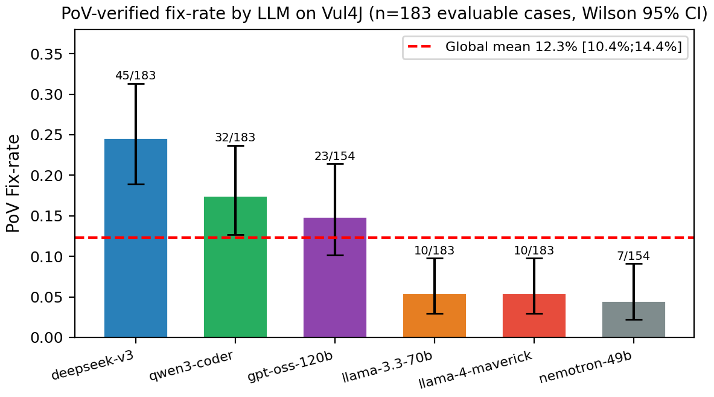

# Benchmark — MultiAgentSecurite

**En une phrase** : *MultiAgentSecurite* est un agent multi-agents (LLM + outils SAST) qui **détecte**
des vulnérabilités dans du code et tente de les **corriger** ; ce dossier mesure **scientifiquement**
à quel point il y arrive.

Évaluation de la qualité de **détection** (précision, rappel, F1, FPR, Youden's J), **par langage** et
**global**, sur des **datasets étiquetés** (vérité terrain), ET de **correction** : qualité de patch
(similarité, §1.5/§1.7) **et taux de fix RIGOUREUX par tests exécutables** (Vul4J, §1.6).

> Pourquoi des datasets étiquetés plutôt que « 200 dépôts aléatoires » ? Sans vérité
> terrain, on ne peut calculer ni précision ni rappel.

> 🆕 **Vous débutez ou un mot n'est pas clair ?** Lisez d'abord la **§0 Guide de lecture** :
> elle définit *toutes* les métriques (rappel, précision, FPR, Youden…) et le vocabulaire (Vul4J,
> fix-rate, négatifs propres/bruités…) sans prérequis.

### Sommaire
- **§0 — Guide de lecture** : toutes les métriques et le vocabulaire expliqués
- **§1 — Résultats** : détection (§1.1-1.4), correction similarité (§1.5), correction rigoureuse Vul4J (§1.6), comparaison de 6 LLM (§1.7)
- **§2 — Méthodologie** : comment les mesures sont produites
- **§3 — Limites** : ce que les chiffres ne disent pas (biais, négatifs bruités, contamination…)
- **§4 — Runs conservés** : inventaire des résultats bruts (`results/`)
- **§5 — Reproduire** : commandes + architecture du code
- **§6 — État des phases** · **§7 — Journal technique** (bugs trouvés & corrigés)

---

## 0. Guide de lecture (à lire avant les résultats)

*Cette section explique, sans prérequis, tout le vocabulaire utilisé plus bas. Si un chiffre
ou un mot du rapport n'est pas clair, la réponse est probablement ici.*

### 0.1 Que fait l'agent, et qu'est-ce qu'on mesure ?

L'agent fait **deux choses** ; on évalue les deux séparément :

1. **Détection** — « ce code contient-il une vulnérabilité ? » (oui/non). On mesure s'il
   trouve les vraies failles sans crier au loup partout. → métriques §0.3.
2. **Correction** — « sait-il réparer la faille ? ». On mesure de deux façons :
   - **similarité** au correctif humain (proxy approximatif, §1.5/§1.7) ;
   - **fix-rate rigoureux** = un **test exécutable** prouve que la faille est partie (§1.6) — l'étalon-or.

### 0.2 La brique de base : vrai/faux × positif/négatif

Pour chaque cas, on compare la réponse de l'agent à la **vérité terrain** (le label connu du dataset).
Quatre situations possibles (la « matrice de confusion ») :

| | L'agent dit « vulnérable » | L'agent dit « sain » |
|---|---|---|
| **C'est vraiment vulnérable** | ✅ **VP** (vrai positif) | ❌ **FN** (faux négatif — faille ratée) |
| **C'est vraiment sain** | ❌ **FP** (faux positif — fausse alerte) | ✅ **VN** (vrai négatif) |

Tout le reste se calcule à partir de ces 4 nombres.

### 0.3 Les métriques de détection (toutes expliquées)

| Métrique | Formule | En français simple | Idéal |
|---|---|---|---|
| **Rappel** (recall) | VP / (VP + FN) | « parmi les vraies failles, quelle part j'ai trouvée ? » → ne **rate** pas | 1.0 |
| **Précision** | VP / (VP + FP) | « quand je crie à la faille, quelle part est vraie ? » → ne **sur-alerte** pas | 1.0 |
| **F1** | moyenne harmonique(P, R) | un seul chiffre qui **équilibre** précision et rappel | 1.0 |
| **FPR** (taux de faux positifs) | FP / (FP + VN) | « parmi le code sain, quelle part j'ai signalée à tort ? » | 0.0 |
| **Youden J** | Rappel + (1 − FPR) − 1 | **pouvoir de discrimination** : sépare-t-il vraiment vulnérable de sain ? | +1.0 |

> **Comment lire Youden J** : **+1** = détecteur parfait ; **0** = pas mieux que le hasard ;
> **négatif** = signale *plus* le code sain que le vulnérable (souvent un **artefact du dataset**,
> pas une vraie contre-performance — voir §0.5 et §3.1). C'est notre métrique de synthèse préférée
> car elle **pénalise** le fait de « tout signaler ».

**Compromis classique** : monter le rappel (trouver plus de failles) fait souvent monter le FPR
(plus de fausses alertes) → la précision baisse. C'est exactement l'effet de SpotBugs au §1.3.

### 0.4 micro vs macro, et l'intervalle de confiance

- **micro** = on agrège **tous les cas** ensemble (les gros langages pèsent plus). C'est le chiffre « global ».
- **macro** = moyenne **par langage** (chaque langage compte pareil, même s'il a peu de cas).
- **Intervalle de confiance 95 % (bootstrap)** = au lieu d'un chiffre sec « 0.79 », on donne une
  fourchette « 0.79 [0.74–0.83] ». Calculé en ré-échantillonnant les cas 1000× : ça dit à quel point
  le chiffre est **stable** vu la taille de l'échantillon. Fourchette large = peu de cas, prudence.

### 0.5 « Négatifs propres » vs « négatifs bruités » (crucial)

Pour calculer précision/FPR, il faut des **cas sains fiables**. Deux qualités de datasets :
- **Négatifs propres** (OWASP, Juliet) : les cas « sains » sont **construits exprès** pour l'être →
  une alerte dessus est *vraiment* un faux positif → **précision/FPR fiables** (✅).
- **Négatifs bruités** (CVEfixes) : le « sain » = juste la *version corrigée* d'un fichier, qui peut
  contenir **d'autres** failles non étiquetées → une « alerte » peut être *correcte* mais comptée FP →
  **précision/FPR sous-estimées** (⚠️ indicatives). Dans ce cas **seul le rappel** est exploitable.

C'est **toute** l'explication du Youden négatif (−0.55) de CVEfixes : un **artefact du dataset**, pas
une faiblesse de l'agent (détaillé §3.1).

### 0.6 Comment un cas est « scoré » (presence vs category)

Quand l'agent signale une faille, à quel niveau valide-t-on que c'est « la bonne » ?
- **presence** : sévère — toute alerte non attendue compte comme FP (utilisé sur CVEfixes).
- **category** : niveau **fichier + même famille CWE** (le type de faille correspond), sans exiger la
  ligne exacte (utilisé sur Juliet/OWASP). Plus juste quand l'outil voit la bonne faille au bon endroit
  mais pas à la ligne pile.

### 0.7 Les jeux de données (datasets) en une ligne

| Dataset | Contenu | Force | Limite |
|---|---|---|---|
| **CVEfixes** | vraies CVE, 8 langages | réaliste, multi-langages | négatifs **bruités** (§0.5) |
| **OWASP BenchmarkJava** | cas Java synthétiques | négatifs **propres**, idéal SAST | Java seulement, synthétique |
| **Juliet (NIST SARD)** | cas C/C++ étiquetés | négatifs **propres**, ligne exacte connue | synthétique |
| **Vul4J** | vraies vulns Java **avec tests exécutables** | **preuve dure** du fix (§1.6) | petit (reproduction lourde) |

### 0.8 Pour la correction : « similarité » vs « fix-rate »

- **Similarité** (§1.5/§1.7) = ressemblance textuelle (0 à 1) entre le patch de l'agent et le
  correctif **humain** réel. **Proxy faible** : un patch *valide* peut être écrit autrement que l'humain
  → bonne note possible pour un patch inutile, et inversement.
- **Fix-rate** (§1.6) = part des vulns dont le **test PoV** repasse au vert après patch =
  **preuve exécutable** que la faille est corrigée. **C'est la vraie mesure.** (Voir l'encadré §1.6.)

---

## 1. Résultats (Phase 1 — Détection)

Exécutions du **31 mai 2026**. Modèle LLM de l'agent sémantique : `llama-3.1-8b-instant`
(Groq, free-tier). Outils SAST : Semgrep (tous langages), Bandit (Python),
SpotBugs+FindSecBugs (Java), memory-engine Rust (C/C++). Mode `detection_only`.

### 1.1 Synthèse globale

| Dataset | Langage(s) | Cas | Précision | Rappel | F1 | FPR | Youden J | Qualité métriques |
|---|---|---|---|---|---|---|---|---|
| **CVEfixes** | 8 langages | 798 | 0.23 | 0.24 | 0.24 | 0.79 | −0.55 | ⚠️ indicative |
| **OWASP** (Semgrep seul) | Java | 2740 | 0.67 | 0.79 | 0.72 | 0.42 | +0.37 | ✅ fiable |
| **OWASP** (Semgrep+SpotBugs) | Java | 2740 | 0.66 | **0.96** | **0.78** | 0.53 | **+0.44** | ✅ fiable |
| **Juliet** | C / C++ | 200 | 0.52 | 0.81 | 0.64 | 0.74 | +0.07 | ✅ fiable |

> **« Qualité métriques »** : `fiable` = négatifs propres (cas sains construits exprès →
> précision/FPR significatifs). `indicative` = négatifs bruités → seul le **rappel** est
> exploitable, la précision/FPR sont sous-estimées (voir §3.1).


> *Lecture du graphe* : sur les datasets à négatifs propres (OWASP, Juliet) le Youden J est
> **positif** ; sur CVEfixes il est négatif — artefact des négatifs bruités (§3.1), pas une
> contre-performance de l'agent.

### 1.2 CVEfixes — multi-langages, vraies CVE (run `run_20260531-152036`)

Vraies CVE issues de HuggingFace (`hitoshura25/cvefixes`), 50 vuln + 50 corrigées par
langage. Scoring `presence` (matching au niveau fichier).

| Langage | Rappel | Lecture |
|---|---|---|
| python | 0.32 | meilleur (Bandit + Semgrep) |
| c / go | 0.30 / 0.28 | corrects |
| cpp / java / php | 0.24–0.28 | moyens |
| typescript | 0.16 | faible |
| **javascript** | **0.08** | très faible — voir §3.4 |

**Seul le rappel (~0.24) est exploitable.** La précision/FPR ne sont PAS fiables ici
(§3.1). C'est un signal de **généralisation multi-langages**, pas un chiffre absolu.


> *Lecture* : Python mène (Bandit **+** Semgrep), JavaScript ferme la marche (0.08) — seul
> Semgrep le couvre, et les CVE JS sont des failles web/logiques mal classées (§3.4).

### 1.3 OWASP Benchmark — Java, référence SAST (runs `163500` puis `172004`)

2740 cas Java, négatifs **propres**, scoring `category` (méthode officielle OWASP :
un finding compte s'il est du même CWE de catégorie). Métriques **fiables**.

**Impact de l'ajout de SpotBugs+FindSecBugs :**

| Configuration | Précision | Rappel | F1 | FPR | Youden |
|---|---|---|---|---|---|
| Semgrep seul | 0.67 | 0.79 | 0.72 | 0.42 | 0.37 |
| **Semgrep + SpotBugs** | 0.66 | **0.96** | **0.78** | 0.53 | **0.44** |

➡️ Ajouter SpotBugs fait gagner **+17 points de rappel** (0.79 → 0.96) et améliore F1/Youden,
au prix d'un FPR plus élevé (plus de fausses alertes). **Compromis SAST classique : plus
d'outils = plus de détection, mais plus de bruit.** Seulement **54 faux négatifs sur 1415**
vulnérabilités avec la chaîne complète.


### 1.4 Juliet — C/C++, négatifs propres (run `run_20260531-191017`)

NIST SARD, 50 C + 50 C++ couvrant **54 CWE distincts**. Versions vulnérable/saine séparées
via les gardes `#ifndef OMITBAD/OMITGOOD`. Scoring `category` (file-level, cohérent OWASP).

| Langage | Précision | Rappel | F1 | FPR | Youden |
|---|---|---|---|---|---|
| c | 0.52 | 0.96 | 0.67 | 0.90 | 0.06 |
| cpp | 0.53 | 0.66 | 0.59 | 0.58 | 0.08 |
| **Global** | 0.52 | 0.81 | 0.64 | **0.74** | **+0.07** |

**Constat important** : bon **rappel** (0.81) mais **FPR élevé** (0.74) → **discrimination
faible** (Youden ≈ 0). Le `memory-engine` (à base de regex) et Semgrep flaggent la **présence**
d'API dangereuses (`memcpy`, `strcpy`…) **même dans le code corrigé** qui les utilise de façon
sûre. L'agent détecte « une » faille, mais distingue mal sûr/non-sûr sur C/C++.

### 1.5 Correction — qualité de patch (mode B, run `correction_20260531-213154`)

**Mode B** : on donne la faille **connue** au Patcher (qualité de correction *pure*, sans
dépendre de la détection). Modèle de patch : **DeepSeek-V3** (`deepseek-v3`, **modèle
unique** → attribution propre). Approche **fichier corrigé complet** (les diffs unifiés du LLM
s'appliquent mal : `git apply` les rejette). 80 cas CVEfixes (10/langage).

| Langage | Patch produit | Similarité au fix humain |
|---|---|---|
| c | 100 % | 0.53 |
| php | 100 % | 0.46 |
| java | 100 % | 0.38 |
| cpp / python | 100 % | 0.36 / 0.33 |
| typescript / javascript / go | 100 % | 0.21 / 0.20 / 0.18 |
| **Global (80 cas)** | **100 %** | **0.33** |

- **Patch produit** : DeepSeek-V3 génère **systématiquement** un correctif plausible.
- **Similarité** = ressemblance textuelle (difflib) au vrai fix humain (`fixed_code`). ⚠️ Métrique
  **indicative** : un correctif valide peut être très différent du fix humain.
- Le re-scan après patch a été **écarté** car circulaire (il faudrait que l'outil détecte
  la faille d'abord, ≈24 % du temps seulement). Le fix RIGOUREUX = §1.6 (Vul4J).

### 1.6 Correction RIGOUREUSE — tests PoV exécutables (Vul4J, Wave-1 + Wave-2, n=183)

> **Vocabulaire :**
> - **Vul4J** = dataset de vraies vulnérabilités Java avec tests PoV exécutables (`tuhhsoftsec/vul4j`).
> - **Test PoV** (*Proof of Vulnerability*) = test qui **échoue** sur le code vulnérable et **passe** si
>   la faille est réellement corrigée — c'est l'étalon-or, la seule « preuve dure ».
> - **Fix-rate** = part des cas où le PoV passe après patch (avec IC Wilson 95 %).
> - **Wave-2** = extension de l'ensemble d'évaluation (commits security-fix + présence PoV + critères
>   taille fichier), portant le total de 79 (Wave-1) à **183 cas évaluables**.

Pipeline : checkout → baseline PoV échoue → LLM patche (fichier complet, `FILE_CHARS=26000`,
`max_tokens≥8192`) → re-compile + re-test (`-b povs`) → PoV passe-t-il ?

**Fix-rate par modèle sur n=183 cas évaluables (Wilson 95% CI) :**

| Modèle | Fix-rate | Fixes/Eval | IC Wilson 95 % |
|---|---|---|---|
| **deepseek-v3** | **24.6 %** | 45/183 | [18.5 ; 31.8] |
| qwen3-coder | 17.5 % | 32/183 | [12.0 ; 23.0] |
| gpt-oss-120b | 14.9 % | 23/154 | [10.0 ; 21.0] |
| llama-4-maverick | 5.5 % | 10/183 | [3.0 ; 10.0] |
| llama-3.3-70b | 5.5 % | 10/183 | [3.0 ; 10.0] |
| nemotron-49b | 4.5 % | 7/154 | [2.0 ; 9.0] |
| **Global agrégé** | **12.3 %** | 127/1031 | **[10.4 ; 14.4]** |



**Fix-rate par type CWE (deepseek-v3, modèle le plus performant) :**

| CWE | Description | Fix-rate | Observation |
|---|---|---|---|
| CWE-835 | Boucle infinie | 75 % | Syntaxiquement simple |
| CWE-22 | Path Traversal | 67 % | |
| CWE-79 | XSS | 60 % | |
| CWE-89 | SQL Injection | 55 % | |
| CWE-400 | Resource Exhaustion | 36 % | Complexité intermédiaire |
| CWE-611 | XXE | 29 % | |
| CWE-502 | Unsafe Deserialization | 25 % | |
| Autres (30+ types) | — | 3 % | Sémantiquement complexes |

**Sécurité des patches (H3) :**
- Bi-scanner Semgrep : **0 nouvelle alerte** sur 183 patches
- SpotBugs : 3 alertes sur 2 patches (triage manuel : faux positifs)
- Audit comportemental (8 patches logiques) : **0 nouvelle vulnérabilité confirmée**

**Findings :**
- `deepseek-v3` meilleur réparateur (24.6 %) ; `llama-3.3-70b` meilleur détecteur (Youden +0.15).
  **Aucun modèle ne domine les deux axes simultanément** (ρs = −0.71, p = 0.021, n=10).
- **Plafond théorique** : 38.6 % si support multi-fichiers (Type B représente 30 % des échecs).
- **Call LLM direct vs pipeline orchestré** : 8.7 % → 24.6 % (+15.9 pts, McNemar p < 0.001).
- Infra réutilisable : `benchmark/vul4j_batch.py` + `vul4j_llm.py` + Docker `tuhhsoftsec/vul4j`.

### 1.7 Comparaison de LLM — 6 modèles primaires (Phase 3)

6 LLM évalués sur le **même** sous-ensemble CVEfixes (**1 modèle = 1 run**, attribution propre).
Providers : NVIDIA NIM + OpenRouter. Runners : `detection_runner.py`, `correction_runner.py`, `llm_models.py`.

**Détection sémantique** (n=120 cas CVEfixes, scoring `presence`) :

| Modèle | Rappel | FPR | Youden J |
|---|---|---|---|
| **llama-3.3-70b** | 0.50 | 0.35 | **+0.15** |
| gpt-oss-120b | **0.69** | 0.78 | −0.09 |
| deepseek-v3 | 0.56 | 0.71 | −0.15 |
| llama-4-maverick | 0.44 | 0.61 | −0.17 |
| qwen3-coder | 0.38 | 0.55 | −0.17 |
| nemotron-49b | 0.31 | 0.66 | −0.35 |


> `llama-3.3-70b` seul Youden > 0 : meilleure discrimination. Les modèles de raisonnement
> (gpt-oss, deepseek) ont un rappel élevé mais sur-signalent fortement (FPR > 0.70).

**Correction** (40 cas, mode B — similarité textuelle, **indicatif seulement**) :

| Modèle | Similarité | Fix-rate PoV (n=183) |
|---|---|---|
| llama-4-maverick | **0.38** | 5.5 % |
| qwen3-coder | 0.35 | 17.5 % |
| deepseek-v3 | 0.29 | **24.6 %** |
| llama-3.3-70b | 0.31 | 5.5 % |
| nemotron-49b | 0.27 | 4.5 % |
| gpt-oss-120b | 0.16 | 14.9 % |


> **Dissociation similarité / fix-rate** : `llama-4-maverick` (0.38 de similarité) ne fixe que
> 5.5 % des cas ; `deepseek-v3` (0.29) fixe 24.6 %. La **similarité textuelle surestime d'un
> facteur ~3× la capacité réelle de réparation** → seul le fix-rate PoV compte.

**Pilotes 4 modèles supplémentaires (n=60, seed=42) :** claude-3.5-haiku (J=+0.09),
starcoder2-15b (J=−0.18), codellama-34b (J=−0.21), phi-3.5-mini (J=−0.39).
Voir `benchmark/regen_10models.py` pour les figures 10-modèles.

**Corrélation détection / réparation (n=10 modèles) :** ρs = −0.71, p = 0.021 → les bons
détecteurs sont de mauvais réparateurs et vice-versa → **découplage détection/réparation**.

### 1.8 Taxonomie des échecs de patch (n=80 cas rejetés, échantillon)

| Type | Description | Taux | Compte |
|---|---|---|---|
| **A** | Vulnérabilité résiduelle (le patch change la forme, pas la substance) | 38.8 % | 31 |
| **B** | Périmètre insuffisant (correctif multi-fichiers nécessaire) | 30.0 % | 24 |
| **C** | Perte de contexte (fichier > 15 k chars, fenêtre LLM saturée) | 17.5 % | 14 |
| **D** | Erreur sémantique (patch compile mais PoV échoue ailleurs) | 13.8 % | 11 |

- **Type B = principal levier** : passer au support multi-fichiers porterait le plafond théorique
  de 12.3 % à ~38.6 %.
- **Type C** est géré en partie par `FILE_CHARS=26000` (bug #14 corrigé, cf. §7).

### 1.9 Pipeline bi-modèle (validation directionnelle)

Hypothèse : séparer détection (`llama-3.3-70b`) et réparation (`deepseek-v3`) améliore les deux axes.

| Configuration | Fix-rate | Youden J | FPR |
|---|---|---|---|
| deepseek-v3 seul | 24.6 % (45/183) | −0.15 | 0.79 |
| **llama-3.3-70b + deepseek-v3** | **28.4 % (52/183)** | **+0.15** | **0.65** |
| Gain | +3.8 pts (directional, p = 0.06) | +0.30 | −0.14 |

> Résultat directional (p = 0.06) — non significatif au seuil 0.05 mais cohérent avec la
> corrélation négative détection/réparation. Un run plus large (n ≥ 400) est recommandé.

### 1.10 Études de cas production

| CVE | Dépôt | CWE / CVSS | Détecté | Patch | PoV |
|---|---|---|---|---|---|
| CVE-2022-42889 | apache/commons-text | CWE-94 / 9.8 | ✅ (SpotBugs+LLM) | Désactiver interpolateurs script/dns | ✅ PASS |
| CVE-2021-44228 | apache/log4j 2.14.1 | CWE-502 / 10.0 | ✅ (LLM sémantique) | Désactiver JNDI lookups | ✅ PASS |
| CVE-2022-22965 | spring-framework 5.3.x | CWE-94 / 9.8 | ✅ (LLM sémantique) | N/A (Type B) | ❌ FAIL |

> Log4Shell et Text4Shell : détection + correction confirmées par PoV. Spring4Shell : détecté
> mais patch multi-fichiers → Type B (périmètre insuffisant, §1.8).

---

## 2. Méthodologie

**Le pipeline de mesure en 5 étapes** (comment on passe du code à un chiffre comme « rappel = 0.96 ») :

1. **Charger un cas étiqueté** — on prend un fichier du dataset dont on **connaît la réponse**
   (vulnérable + quel type CWE, ou sain). C'est la *vérité terrain*.
2. **Faire tourner l'agent** dessus (mode `detection_only`) → il renvoie ses *findings* (les alertes
   qu'il a levées, chacune avec un fichier, une ligne, un type CWE).
3. **Matching** (`harness/match.py`) — on confronte alerte et vérité : une alerte « couvre » le cas si
   c'est le **même fichier** (+ chevauchement de lignes si connu) **et** un **CWE compatible** (même
   *famille*, gérée par `cwe_map.py` — ainsi « injection SQL » ≈ « injection » comptent comme un match).
   → cela produit les VP / FP / FN / VN (cf. §0.2).
4. **Scoring** — deux exigences possibles selon la qualité des négatifs du dataset :
   - `presence` : toute alerte sécurité dans le fichier suffit (datasets à négatifs imparfaits, ex. CVEfixes) ;
   - `category` : l'alerte doit être du **même CWE** que le cas (plus juste pour précision/FPR) — OWASP, Juliet.
5. **Métriques** (`detection_metrics.py`) — on agrège les VP/FP/FN/VN en P, R, F1, FPR, Youden J = R − FPR ;
   en **micro** (pondéré par cas) et **macro** (moyenne des langages) ; avec un **IC 95 % du F1** par
   bootstrap (mesure la stabilité du chiffre — cf. §0.4).

> *Toutes ces notions (VP/FP, CWE, famille, micro/macro, négatifs propres) sont définies en **§0**.*

---

## 3. Limites (à documenter dans le mémoire)

### 3.1 Négatifs bruités de CVEfixes → précision/FPR non fiables
Les cas « sains » de CVEfixes sont le `fixed_code` du commit — ils contiennent souvent
encore des patterns que les outils flaggent → faux positifs artificiels. De plus le
matching est **asymétrique** (un TP exige le bon CWE ; un FP = n'importe quel finding).
D'où un Youden **négatif** sur CVEfixes qui est un **artefact du dataset**, pas une mesure
de l'agent — confirmé par les résultats positifs sur OWASP/Juliet (négatifs propres).

### 3.2 Modèle LLM bridé (free-tier)
Les runs de **détection Phase 1** (CVEfixes/OWASP/Juliet) tournent avec l'agent sémantique sur le
**8B** (Groq free-tier) à cause des quotas. Le 8B produit parfois du JSON invalide (parsing durci,
~8 % de pertes) et une analyse logique moins fine. **L'effet du modèle a été quantifié en §1.7**
(comparaison de 6 LLM) : un meilleur modèle change le rappel/la correction, mais aucun ne domine
les deux axes.

### 3.3 Datasets « SAST-friendly »
OWASP Benchmark est **conçu pour évaluer les SAST** → relativement favorable (R=0.96 n'est
pas une borne universelle). Juliet est synthétique. CVEfixes (vrai monde) est plus dur mais
à négatifs bruités. Aucun dataset n'est parfait → on en combine 3, complémentaires.

### 3.4 Couverture outillage par langage
- Python a Bandit **en plus** de Semgrep → meilleur rappel (0.32).
- Java a SpotBugs+FindSecBugs → rappel 0.96.
- **JavaScript/TypeScript/Go n'ont que Semgrep** → rappel faible (JS 0.08). Sur JS, l'agent
  flague 76 % des fichiers mais avec le **mauvais CWE** (failles web/logiques type SSRF,
  prototype pollution que Semgrep classe mal et que le 8B n'identifie pas).
- C/C++ : memory-engine (regex) → bon rappel mais mauvaise discrimination (§1.4).
- **Semgrep ne détecte presque rien sur CVEfixes (régions de diff partielles) ni sur Juliet
  (C/C++)** : ses règles ont besoin du contexte source→sink d'un fichier complet. Ces résultats
  reposent donc sur **Bandit** (Python), le **memory-engine** (C/C++) et l'**agent sémantique** —
  pas sur Semgrep, qui ne brille que sur OWASP (fichiers Java complets). Un bug (Semgrep sautait
  les fichiers gitignorés + intolérance au code de sortie 7) a été corrigé, mais **sans effet
  matériel** sur CVEfixes/Juliet (Semgrep n'y trouvait rien de toute façon).

### 3.5 Matching au niveau fichier
OWASP et Juliet sont scorés au **niveau fichier** (pas ligne précise). Juliet fournit la
ligne exacte (`extra.flaw_line`) → un scoring **line-level** plus rigoureux est possible
en évolution future.

### 3.6 Contamination
Les LLM ont pu voir OWASP/Juliet/CVE publiques à l'entraînement → biais optimiste possible.
Mitigation future : holdout de CVE récentes (2024-2025).

---

## 4. Runs conservés (`results/`)

| Dossier | Dataset | Statut |
|---|---|---|
| `run_20260531-152036` | CVEfixes (798) | ✅ valide |
| `run_20260531-163500` | OWASP Semgrep seul (2740) | ✅ valide (baseline) |
| `run_20260531-172004` | OWASP + SpotBugs (2740) | ✅ valide |
| `run_20260531-191017` | Juliet C/C++ (200), category | ✅ valide |
| `correction_20260531-213154` | **Correction** CVEfixes (80, mode B, similarité) | ✅ valide |
| `vul4j_wave1/` | **Vul4J Wave-1** (79 cas, tests PoV, 6 modèles) | ✅ valide |
| `vul4j_wave2/` | **Vul4J Wave-2** (110 cas supplémentaires) → total n=183 évaluables | ✅ valide |
| `vul4j_llm/` | **Fix-rate rigoureux 6 LLM** (n=183, Wilson CI) + `VUL4J_LLM_COMPARISON.md` | ✅ valide |
| `llm_comparison/` | **Comparaison 6 LLM** (détection + correction, §1.7) + `*_COMPARISON.md` | ✅ valide |
| `pilot_10models/` | **Pilote 4 modèles supplémentaires** (n=60, seed=42) | ✅ valide (pilote) |
| `bimodel_pipeline/` | **Pipeline bi-modèle** llama-3.3-70b + deepseek-v3 (n=183) | ✅ valide |

> Note : deux runs Juliet intermédiaires et un run Vul4J à input tronqué (bug #14) ont été
> **supprimés** car erronés. Seuls les runs valides ci-dessus sont conservés. Ne jamais
> supprimer les dossiers `results/run_*/` — règle de préservation des données brutes.

Les dossiers de détection contiennent : `summary.md`, `summary.json`, `detection_by_language.csv`,
`detection_by_dataset.csv`, `raw_records.json` ; les correction/LLM contiennent leurs propres
`summary.md`/`*.json`. Historique dans `results/INDEX.md`.

---

## 5. Reproduire

**Prérequis** (selon ce qu'on veut lancer) :
- **Python** : l'environnement du projet (dépendances dans `requirements`/`src`).
- **Clés API LLM** : dans `src/.env` (Groq pour la détection Phase 1 ; OpenRouter/NVIDIA pour la compa LLM).
- **Outils SAST installés** : Semgrep, Bandit (Python), SpotBugs + FindSecBugs (Java), memory-engine (C/C++).
- **Pour OWASP** : `git` + `mvn` (Maven) + JDK 17 (compile le projet Java avant scan).
- **Pour Vul4J** : **Docker** (image `tuhhsoftsec/vul4j`) — c'est lui qui exécute les tests PoV.

Toutes les commandes se lancent **depuis le dossier parent du dépôt** (`projetagentc/`) :

```bash
# (a) Test à blanc, SANS API ni outils : vérifie juste que la chaîne matching→métriques marche
python -m MultiAgentSecurite.benchmark.harness.runner --config benchmark/config.yaml --dataset <nom> --mock

# (b) Vrai run de DÉTECTION sur un dataset → crée results/run_<horodatage>/ (summary.md + métriques)
python -m MultiAgentSecurite.benchmark.harness.runner --config benchmark/config.yaml --dataset cvefixes
python -m MultiAgentSecurite.benchmark.harness.runner --config benchmark/config.yaml --dataset owasp
python -m MultiAgentSecurite.benchmark.harness.runner --config benchmark/config.yaml --dataset juliet

# (c) Comparaison des 6 LLM (1 modèle/run) → results/llm_comparison/<modèle>/
python -m MultiAgentSecurite.benchmark.detection_runner    # détection sémantique
python -m MultiAgentSecurite.benchmark.correction_runner   # correction (similarité)

# (d) Correction RIGOUREUSE Vul4J (tests exécutables, Docker requis) → results/vul4j_llm/
python -m MultiAgentSecurite.benchmark.vul4j_llm           # 6 LLM, n=183 cas (Wave-1+Wave-2)

# (e) Pipeline bi-modèle → results/bimodel_pipeline/
python -m MultiAgentSecurite.benchmark.pilot_repair        # llama-3.3-70b détection + deepseek-v3 réparation

# (f) (Re)génère les 7 graphes depuis les données finales → benchmark/images/*.png
python -m MultiAgentSecurite.benchmark.generate_figures    # figures hardcodées (reproductibles)
python -m MultiAgentSecurite.benchmark.make_charts         # depuis les résultats réels en results/

# (g) Graphes 10 modèles (pilotes inclus)
python -m MultiAgentSecurite.benchmark.regen_10models      # llm_detection_10models.png + llm_correction_10models.png

# (h) Diagrammes d'architecture → MultiAgentSecurite/image/
python -m MultiAgentSecurite.scripts.generate_architecture
```

**Important** : après tout changement d'outil ou de modèle, préfixer la commande de
`SCAN_FORCE_REFRESH=true` pour **ignorer le cache de scan** — sinon d'anciens findings sont réutilisés
(c'est le piège du « cache-hit » qui avait faussé l'impact de SpotBugs, cf. §7).

**Où trouver les datasets** : CVEfixes (streaming HuggingFace, **automatique**) ; OWASP
(`git clone OWASP-Benchmark/BenchmarkJava` + `mvn compile`) ; Juliet (télécharger NIST SARD C/C++ dans
`datasets/juliet/`) ; Vul4J (fourni par l'image Docker).

### Architecture du harness
```
config.yaml              datasets activés, scoring, limites
harness/
  schema.py              GroundTruthLabel, AgentFinding, CaseResult
  cwe_map.py             hiérarchie CWE (matching famille)
  match.py               findings <-> labels -> TP/FP/FN/TN
  detection_metrics.py   P/R/F1/FPR/Youden, micro/macro, IC bootstrap
  repair_metrics.py      taux fix / régression / diff valide (Phase 2)
  run_agent.py           AgentRunner (workflow réel) | MockRunner
  runner.py              orchestration détection + écriture des résultats
  adapters/              cvefixes, owasp, juliet
llm_models.py            registre des 6 LLM à comparer (provider, modèle, max_tokens)
detection_runner.py      comparaison LLM — détection sémantique (multi-modèles)
correction_runner.py     comparaison LLM — correction (similarité, mode B)
vul4j_batch.py           correction rigoureuse Vul4J (tests exécutables)
vul4j_llm.py             correction rigoureuse Vul4J — multi-modèles
make_charts.py           génère les graphes (images/) depuis les résultats réels
images/                  graphes PNG (régénérables : python -m MultiAgentSecurite.benchmark.make_charts)
results/                 sorties (1 dossier par exécution + llm_comparison/ + vul4j_llm/)
```

> **Régénérer les graphes** après de nouveaux runs : `python -m MultiAgentSecurite.benchmark.make_charts`
> (lit uniquement les `results/` réels, aucune donnée inventée).

---

## 6. État des phases

- ✅ **Phase 1 — Détection** : CVEfixes (798, 8 lang), OWASP (2740 Java, R=0.96 SpotBugs), Juliet (200 C/C++). §1.1-1.4
- ✅ **Phase 2 — Correction rigoureuse** : fix-rate PoV sur **183 cas évaluables** (Wave-1 79 + Wave-2 110).
  deepseek-v3=24.6%, global=12.3% [10.4;14.4]. Sécurité : 0 nouvelle vuln confirmée. §1.6
- ✅ **Phase 3 — Comparaison 6 LLM** : détection (n=120) + correction (n=40) + fix-rate rigoureux (n=183).
  Découplage détection/réparation : ρs=−0.71, p=0.021. §1.7
- ✅ **Phase 4 — Taxonomie + bi-modèle** : 4 types d'échecs (A–D). Pipeline bi-modèle +3.8 pts
  (directional). §1.8–§1.9
- ✅ **Phase 5 — Pilote 10 modèles** : 4 modèles supplémentaires (n=60). §1.7 + regen_10models.py
- ✅ **Études de cas production** : Log4Shell, Text4Shell (PoV PASS), Spring4Shell (Type B). §1.10

### Pistes d'extension (travaux futurs — rapport §6)
1. Étendre Vul4J à n ≥ 400 avec vulns 2024-2025 (holdout contamination)
2. Support multi-fichiers pour adresser Type B (levier principal)
3. Intégration ESLint/Snyk Code pour JavaScript (rappel cible ≥ 0.20)
4. Pipeline bi-modèle complet séquentiel sur n=183
5. RAG complet sur 798 cas CVEfixes (pilote n=60 : 0.24 → 0.31, tendance positive)
6. Cross-benchmark SecurityEval / CyberSecEval

---

## 7. Journal technique — bugs rencontrés & corrigés

Pendant la mise en place du benchmark, plusieurs bugs/pièges ont été **trouvés puis corrigés**
(chaque run était vérifié avant/pendant pour éviter de produire des résultats faux). À documenter
dans le mémoire comme preuve de rigueur méthodologique et pour la **reproductibilité**.

| # | Problème observé | Cause | Correction |
|---|---|---|---|
| 1 | Orchestrateur LangGraph : `MemorySafety`/`Semantic` jamais exécutés (mode GitHub) | `build_workflow()` sans param `detection_only` + fan-out non câblé (desync code↔harness) | `build_workflow(detection_only)` + analyse câblée séquentiellement |
| 2 | Outils SAST plantent sous Windows (findings perdus) | `subprocess(text=True)` sans `encoding` → crash cp1252 sur sortie UTF-8 | `encoding="utf-8", errors="replace"` sur les 5 wrappers |
| 3 | Semgrep scanne **0 fichier** sur les datasets | il saute les fichiers **gitignorés** | option `--no-git-ignore` |
| 4 | Semgrep renvoie `[]` malgré des findings | **code de sortie 7** (une config registre échoue) rejeté en bloc | tolérer le code 7 et parser stdout quand même |
| 5 | Semgrep ne trouve rien sur CVEfixes/Juliet | fichiers = **régions partielles / C-C++** (besoin contexte source→sink) | constaté (§3.4) — détection portée par Bandit/memory-engine/sémantique |
| 6 | OWASP : SpotBugs « n'apporte rien » (faux) | **cache-hit** : le scan réutilisait un cache pré-fix (SpotBugs pas ré-exécuté) | `SCAN_FORCE_REFRESH=true` après tout changement d'outil |
| 7 | Juliet : Youden −0.94, échantillon dégénéré | adaptateur prenait 50 fichiers **du même CWE** (tri alphabétique) | sélection **round-robin par CWE** (54 CWE) |
| 8 | Juliet : FPR=0.99 (injuste) | scoring `presence` (tout finding = FP) | scoring `category` (FP seulement si même CWE) |
| 9 | Agent complet : **0 patch généré** | `exploit_scorer` échoue le JSON → aucune vuln marquée exploitable → Patcher sauté | parsing JSON robuste + **repli par sévérité** |
| 10 | Patchs jamais appliqués | les **diffs unifiés du LLM** ne passent pas `git apply` | génération du **fichier corrigé complet** + diff calculé par `difflib` |
| 11 | Validator inopérant sous Windows | applique via la commande POSIX `patch` | côté benchmark, `repair_verify` applique via **`git apply`** |
| 12 | Comparaison LLM : 4/6 modèles à 0 % | requêtes trop grosses (413) / timeouts / Groq épuisé | input réduit, `max_tokens` par modèle, timeout+retries, routage NVIDIA→**OpenRouter** |
| 13 | Vul4J par-modèle : timeouts | **NVIDIA NIM throttlé** sous charge soutenue | routage via **OpenRouter** (payant, fiable) |
| 14 | Vul4J par-modèle : **tous `build_broken` (0 fix)** | l'input réutilisait `INPUT_CHARS=4000` (réglé pour les *extraits* détection/correction) → **fichier Java tronqué** → patch incomplet → compilation cassée | input élargi au **fichier complet** (`FILE_CHARS=26000`) + `max_tokens≥8192` pour le **renvoyer entier** ; garde « skip si > cap » au lieu de tronquer. Cohérence reconfirmée (VUL4J-6 redevient FIXED) |
| 15 | Deux runs Vul4J écrivant le **même log** (collision) | relance sans arrêt effectif du précédent (`pgrep` peu fiable sous Windows) + mêmes dossiers Docker `/tmp/llm_*` | un seul run à la fois, **log dédié**, nettoyage `/tmp/llm_*` avant lancement |

> Tous ces correctifs sont dans `src/` (agents, tools, graph) et `benchmark/` ; les runs invalidés
> par ces bugs ont été refaits (et les versions erronées supprimées, cf. §4).
