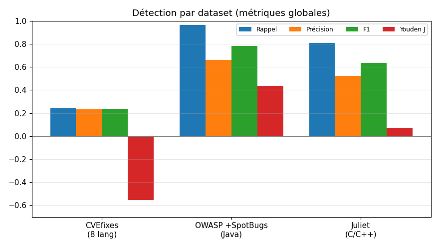
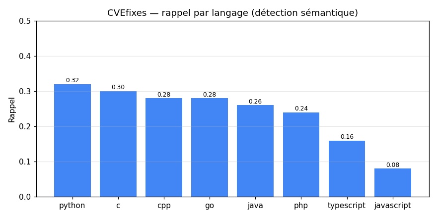
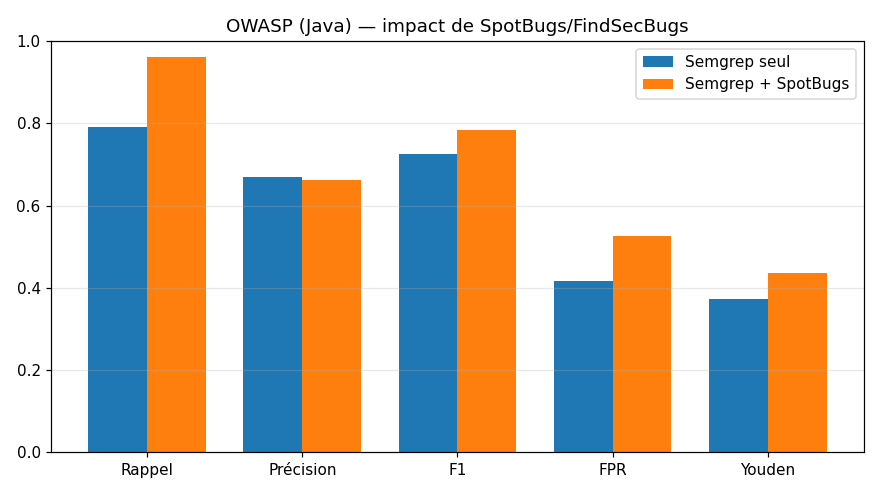
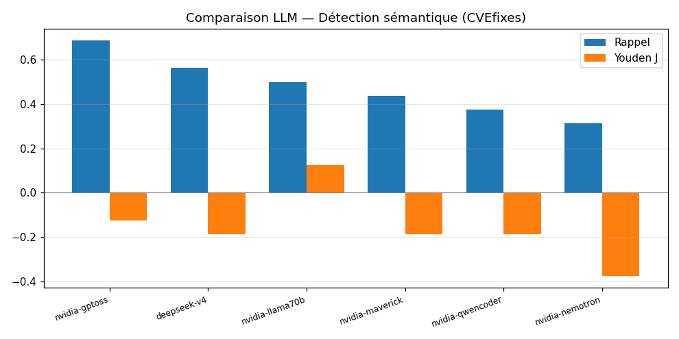
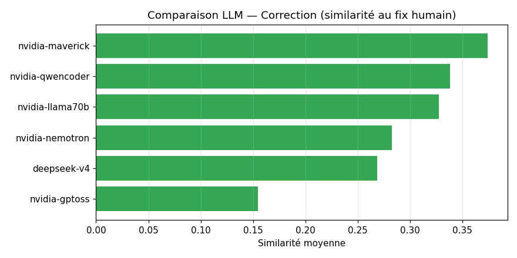

# Benchmark — MultiAgentSecurite

Évaluation **scientifique** de l'agent : qualité de **détection** (précision, rappel,
F1, FPR, Youden's J), **par langage** et **global**, sur des **datasets étiquetés**
(vérité terrain), ET de **correction** : qualité de patch (similarité, §1.5) **et taux de fix
RIGOUREUX par tests exécutables** (Vul4J, §1.6).

> Pourquoi des datasets étiquetés plutôt que « 200 dépôts aléatoires » ? Sans vérité
> terrain, on ne peut calculer ni précision ni rappel.

---

## 1. Résultats (Phase 1 — Détection)

Exécutions du **31 mai 2026**. Modèle LLM de l'agent sémantique : `llama-3.1-8b-instant`
(Groq, free-tier). Outils SAST : Semgrep (tous langages), Bandit (Python),
SpotBugs+FindSecBugs (Java), memory-engine Rust (C/C++). Mode `detection_only`.

### 1.1 Synthèse globale

| Dataset | Langage(s) | Cas | Précision | Rappel | F1 | FPR | Youden J | Qualité métriques |
|---|---|---|---|---|---|---|---|---|
| **CVEfixes** | 8 langages | 798 | 0.23 | 0.24 | 0.24 | 0.79 | −0.55 | ⚠️ indicative |
| **OWASP** (Semgrep seul) | Java | 2740 | 0.67 | 0.79 | 0.72 | 0.42 | +0.37 | ✅ fiable |
| **OWASP** (Semgrep+SpotBugs) | Java | 2740 | 0.66 | **0.96** | **0.78** | 0.53 | **+0.44** | ✅ fiable |
| **Juliet** | C / C++ | 200 | 0.52 | 0.81 | 0.64 | 0.74 | +0.07 | ✅ fiable |

> **« Qualité métriques »** : `fiable` = négatifs propres (cas sains construits exprès →
> précision/FPR significatifs). `indicative` = négatifs bruités → seul le **rappel** est
> exploitable, la précision/FPR sont sous-estimées (voir §3.1).



> *Lecture du graphe* : sur les datasets à négatifs propres (OWASP, Juliet) le Youden J est
> **positif** ; sur CVEfixes il est négatif — artefact des négatifs bruités (§3.1), pas une
> contre-performance de l'agent.

### 1.2 CVEfixes — multi-langages, vraies CVE (run `run_20260531-152036`)

Vraies CVE issues de HuggingFace (`hitoshura25/cvefixes`), 50 vuln + 50 corrigées par
langage. Scoring `presence` (matching au niveau fichier).

| Langage | Rappel | Lecture |
|---|---|---|
| python | 0.32 | meilleur (Bandit + Semgrep) |
| c / go | 0.30 / 0.28 | corrects |
| cpp / java / php | 0.24–0.28 | moyens |
| typescript | 0.16 | faible |
| **javascript** | **0.08** | très faible — voir §3.4 |

**Seul le rappel (~0.24) est exploitable.** La précision/FPR ne sont PAS fiables ici
(§3.1). C'est un signal de **généralisation multi-langages**, pas un chiffre absolu.



> *Lecture* : Python mène (Bandit **+** Semgrep), JavaScript ferme la marche (0.08) — seul
> Semgrep le couvre, et les CVE JS sont des failles web/logiques mal classées (§3.4).

### 1.3 OWASP Benchmark — Java, référence SAST (runs `163500` puis `172004`)

2740 cas Java, négatifs **propres**, scoring `category` (méthode officielle OWASP :
un finding compte s'il est du même CWE de catégorie). Métriques **fiables**.

**Impact de l'ajout de SpotBugs+FindSecBugs :**

| Configuration | Précision | Rappel | F1 | FPR | Youden |
|---|---|---|---|---|---|
| Semgrep seul | 0.67 | 0.79 | 0.72 | 0.42 | 0.37 |
| **Semgrep + SpotBugs** | 0.66 | **0.96** | **0.78** | 0.53 | **0.44** |

➡️ Ajouter SpotBugs fait gagner **+17 points de rappel** (0.79 → 0.96) et améliore F1/Youden,
au prix d'un FPR plus élevé (plus de fausses alertes). **Compromis SAST classique : plus
d'outils = plus de détection, mais plus de bruit.** Seulement **54 faux négatifs sur 1415**
vulnérabilités avec la chaîne complète.



### 1.4 Juliet — C/C++, négatifs propres (run `run_20260531-191017`)

NIST SARD, 50 C + 50 C++ couvrant **54 CWE distincts**. Versions vulnérable/saine séparées
via les gardes `#ifndef OMITBAD/OMITGOOD`. Scoring `category` (file-level, cohérent OWASP).

| Langage | Précision | Rappel | F1 | FPR | Youden |
|---|---|---|---|---|---|
| c | 0.52 | 0.96 | 0.67 | 0.90 | 0.06 |
| cpp | 0.53 | 0.66 | 0.59 | 0.58 | 0.08 |
| **Global** | 0.52 | 0.81 | 0.64 | **0.74** | **+0.07** |

**Constat important** : bon **rappel** (0.81) mais **FPR élevé** (0.74) → **discrimination
faible** (Youden ≈ 0). Le `memory-engine` (à base de regex) et Semgrep flaggent la **présence**
d'API dangereuses (`memcpy`, `strcpy`…) **même dans le code corrigé** qui les utilise de façon
sûre. L'agent détecte « une » faille, mais distingue mal sûr/non-sûr sur C/C++.

### 1.5 Correction — qualité de patch (mode B, run `correction_20260531-213154`)

**Mode B** : on donne la faille **connue** au Patcher (qualité de correction *pure*, sans
dépendre de la détection). Modèle de patch : **DeepSeek V4** (`deepseek-v4-flash`, **modèle
unique** → attribution propre). Approche **fichier corrigé complet** (les diffs unifiés du LLM
s'appliquent mal : `git apply` les rejette). 80 cas CVEfixes (10/langage).

| Langage | Patch produit | Similarité au fix humain |
|---|---|---|
| c | 100 % | 0.53 |
| php | 100 % | 0.46 |
| java | 100 % | 0.38 |
| cpp / python | 100 % | 0.36 / 0.33 |
| typescript / javascript / go | 100 % | 0.21 / 0.20 / 0.18 |
| **Global (80 cas)** | **100 %** | **0.33** |

- **Patch produit** : DeepSeek V4 génère **systématiquement** un correctif plausible.
- **Similarité** = ressemblance textuelle (difflib) au vrai fix humain (`fixed_code`). ⚠️ Métrique
  **indicative** : un correctif valide peut être très différent du fix humain.
- Le re-scan après patch a été **écarté** car circulaire (il faudrait que l'outil détecte
  la faille d'abord, ≈24 % du temps seulement). Le fix RIGOUREUX = §1.6 (Vul4J).

### 1.6 Correction RIGOUREUSE — tests exécutables (Vul4J, run `vul4j_20260601-084641`)

Vraies vulnérabilités Java reproductibles **avec tests PoV exécutables** (le seul moyen de
prouver « ça corrige vraiment »), via le conteneur Docker `tuhhsoftsec/vul4j`. Pipeline :
checkout → baseline (le test PoV échoue) → DeepSeek V4 patche (fichier complet) → re-compile
+ re-test (`-b povs`) → le test PoV passe-t-il ?

| Vuln | Projet (CWE) | Résultat |
|---|---|---|
| **VUL4J-6** | commons-compress (CWE-835, boucle infinie) | ✅ **FIXÉ** (PoV passe) |
| VUL4J-1 | fastjson (CWE-20) | ❌ not_fixed |
| VUL4J-8 | commons-compress (CWE-835) | ❌ not_fixed |
| VUL4J-12 | commons-imaging (CWE-835) | ❌ build cassé par le patch |
| **Taux de fix** | (sur 4 reproduites) | **1/4 = 25 %** |

- **VUL4J-6 = succès vérifié par test exécutable** : DeepSeek V4 corrige réellement la faille
  (boucle infinie commons-compress) et le test PoV passe. Preuve « dure » que l'agent peut corriger.
- Échecs typiques : le patch **ne corrige pas** (full-file ne cible pas la bonne ligne) ou
  **casse le build** (fragilité du fichier-complet sur du Java complexe).
- ⚠️ **Petit échantillon** (8 tentées, 4 reproduites). 4 cas non reproduits = à affiner
  (parseur baseline en mode `povs`). Étendre le run renforcerait le taux.
- Infra réutilisable : `benchmark/vul4j_batch.py` + image Docker `tuhhsoftsec/vul4j`.

### 1.7 Comparaison de LLM (Phase 3)

6 LLM évalués sur le **même** sous-ensemble CVEfixes (**1 modèle = 1 run**, attribution propre ;
pas de mélange). Providers : NVIDIA NIM (gratuit) + DeepSeek (payant). Runners :
`detection_runner.py`, `correction_runner.py`, registre `llm_models.py`.

**Détection sémantique** (32 cas vuln+sain ; c'est l'agent LLM qui détecte sur CVEfixes) :

| Modèle | Rappel | Précision | FPR | Youden J |
|---|---|---|---|---|
| **llama-3.3-70b** (NVIDIA) | 0.50 | 0.57 | 0.38 | **+0.12** |
| gpt-oss-120b (raisonnement) | **0.69** | 0.46 | 0.81 | −0.12 |
| deepseek-v4-flash (raisonnement) | 0.56 | 0.43 | 0.75 | −0.19 |
| llama-4-maverick (MoE) | 0.44 | 0.41 | 0.62 | −0.19 |
| qwen3-coder-480b (spécialisé code) | 0.38 | 0.40 | 0.56 | −0.19 |
| nemotron-super-49b | 0.31 | 0.31 | 0.69 | −0.38 |



**Correction** (40 cas, mode B ; taux de patch produit + similarité au fix humain) :

| Modèle | Patch produit | Similarité au fix humain |
|---|---|---|
| **llama-4-maverick** (MoE) | 100 % | **0.37** |
| qwen3-coder-480b (code) | 100 % | 0.34 |
| llama-3.3-70b | 88 % | 0.33 |
| nemotron-super-49b | 100 % | 0.28 |
| deepseek-v4-flash | 100 % | 0.27 |
| gpt-oss-120b | 100 % | 0.15 |



> ⚠️ La **similarité** est une métrique faible (un correctif valide peut diverger du fix humain).
> Le classement **rigoureux** par tests exécutables est dans `results/vul4j_llm/` (Vul4J multi-modèles).

**Analyse :**
- **Détection** : `llama-3.3-70b` a la **meilleure discrimination** (Youden +0.12, seul positif).
  Les modèles à **raisonnement** (gpt-oss R=0.69, deepseek R=0.56) **détectent davantage** mais
  **sur-signalent** (FPR 0.75-0.81). Le **spécialisé code** (qwen-coder) n'est PAS le meilleur
  détecteur (R=0.38).
- **Correction** : `llama-4-maverick` (MoE généraliste) **mène** (sim 0.37), devant le code-spécialisé
  qwen-coder (0.34). Le **raisonnement ne gagne pas** (gpt-oss 0.15).
- **Conclusion** : **aucun LLM ne domine les deux axes** ; ni la spécialisation code ni le raisonnement
  n'apportent un avantage net → l'**architecture multi-agents est relativement robuste au choix du LLM**.
  C'est une contribution intéressante en soi.
- **Caveats** : CVEfixes a des négatifs bruités → FPR/Youden **indicatifs** (mais comparaison
  **relative valide**, mêmes cas pour tous). Échantillon **réduit** (32-40 cas) car le free-tier
  (NVIDIA/Groq) throttle sous charge soutenue. La correction **rigoureuse** (Vul4J, tests exécutables)
  n'a été faite que pour 1 modèle (deepseek, 1/4) — l'étendre par modèle est lourd (builds Docker).

---

## 2. Méthodologie

- **Vérité terrain** : chaque cas est étiqueté vulnérable (avec CWE) ou sain.
- **Matching** (`harness/match.py`) : un finding « couvre » un label si même fichier
  (+ chevauchement de lignes si dispo) **et** CWE compatible (`family` via `cwe_map.py`).
- **Scoring** :
  - `presence` : tout finding sécurité dans le fichier suffit (cas à négatifs imparfaits).
  - `category` : le finding doit être du **même CWE** que le cas (méthode OWASP, équitable
    pour la précision/FPR) — utilisé pour OWASP et Juliet.
- **Métriques** (`detection_metrics.py`) : P, R, F1, FPR, Youden J = R − FPR ; micro
  (pondéré par cas) et macro (moyenne des langages) ; **IC 95 % du F1** par bootstrap.

---

## 3. Limites (à documenter dans le mémoire)

### 3.1 Négatifs bruités de CVEfixes → précision/FPR non fiables
Les cas « sains » de CVEfixes sont le `fixed_code` du commit — ils contiennent souvent
encore des patterns que les outils flaggent → faux positifs artificiels. De plus le
matching est **asymétrique** (un TP exige le bon CWE ; un FP = n'importe quel finding).
D'où un Youden **négatif** sur CVEfixes qui est un **artefact du dataset**, pas une mesure
de l'agent — confirmé par les résultats positifs sur OWASP/Juliet (négatifs propres).

### 3.2 Modèle LLM bridé (free-tier)
Les runs de **détection Phase 1** (CVEfixes/OWASP/Juliet) tournent avec l'agent sémantique sur le
**8B** (Groq free-tier) à cause des quotas. Le 8B produit parfois du JSON invalide (parsing durci,
~8 % de pertes) et une analyse logique moins fine. **L'effet du modèle a été quantifié en §1.7**
(comparaison de 6 LLM) : un meilleur modèle change le rappel/la correction, mais aucun ne domine
les deux axes.

### 3.3 Datasets « SAST-friendly »
OWASP Benchmark est **conçu pour évaluer les SAST** → relativement favorable (R=0.96 n'est
pas une borne universelle). Juliet est synthétique. CVEfixes (vrai monde) est plus dur mais
à négatifs bruités. Aucun dataset n'est parfait → on en combine 3, complémentaires.

### 3.4 Couverture outillage par langage
- Python a Bandit **en plus** de Semgrep → meilleur rappel (0.32).
- Java a SpotBugs+FindSecBugs → rappel 0.96.
- **JavaScript/TypeScript/Go n'ont que Semgrep** → rappel faible (JS 0.08). Sur JS, l'agent
  flague 76 % des fichiers mais avec le **mauvais CWE** (failles web/logiques type SSRF,
  prototype pollution que Semgrep classe mal et que le 8B n'identifie pas).
- C/C++ : memory-engine (regex) → bon rappel mais mauvaise discrimination (§1.4).
- **Semgrep ne détecte presque rien sur CVEfixes (régions de diff partielles) ni sur Juliet
  (C/C++)** : ses règles ont besoin du contexte source→sink d'un fichier complet. Ces résultats
  reposent donc sur **Bandit** (Python), le **memory-engine** (C/C++) et l'**agent sémantique** —
  pas sur Semgrep, qui ne brille que sur OWASP (fichiers Java complets). Un bug (Semgrep sautait
  les fichiers gitignorés + intolérance au code de sortie 7) a été corrigé, mais **sans effet
  matériel** sur CVEfixes/Juliet (Semgrep n'y trouvait rien de toute façon).

### 3.5 Matching au niveau fichier
OWASP et Juliet sont scorés au **niveau fichier** (pas ligne précise). Juliet fournit la
ligne exacte (`extra.flaw_line`) → un scoring **line-level** plus rigoureux est possible
en évolution future.

### 3.6 Contamination
Les LLM ont pu voir OWASP/Juliet/CVE publiques à l'entraînement → biais optimiste possible.
Mitigation future : holdout de CVE récentes (2024-2025).

---

## 4. Runs conservés (`results/`)

| Dossier | Dataset | Statut |
|---|---|---|
| `run_20260531-152036` | CVEfixes (798) | ✅ valide |
| `run_20260531-163500` | OWASP Semgrep seul (2740) | ✅ valide (baseline) |
| `run_20260531-172004` | OWASP + SpotBugs (2740) | ✅ valide |
| `run_20260531-191017` | Juliet C/C++ (200), category | ✅ valide |
| `correction_20260531-213154` | **Correction** CVEfixes (80, mode B, similarité) | ✅ valide |
| `vul4j_20260601-084641` | **Correction rigoureuse** Vul4J (tests exécutables, fix-rate 1/4) | ✅ valide |
| `llm_comparison/` | **Comparaison de 6 LLM** (détection + correction, §1.7) + `*_COMPARISON.md` | ✅ valide |

> Note : deux runs Juliet intermédiaires ont été produits puis **supprimés** car erronés —
> un échantillon dégénéré (1 seul CWE, bug d'échantillonnage corrigé) et une version au
> scoring `presence` (remplacée par `category`). Seuls les runs valides ci-dessus sont conservés.

Les dossiers de détection contiennent : `summary.md`, `summary.json`, `detection_by_language.csv`,
`detection_by_dataset.csv`, `raw_records.json` ; les correction/LLM contiennent leurs propres
`summary.md`/`*.json`. Historique dans `results/INDEX.md`.

---

## 5. Reproduire

Depuis le dossier parent du dépôt (`projetagentc/`), avec l'environnement Python du projet :

```bash
# Test à blanc (sans API), valide la chaîne matching/métriques
python -m MultiAgentSecurite.benchmark.harness.runner --config benchmark/config.yaml --dataset <nom> --mock

# Vrai run d'un dataset (clés API dans src/.env + outils SAST installés)
python -m MultiAgentSecurite.benchmark.harness.runner --config benchmark/config.yaml --dataset cvefixes
python -m MultiAgentSecurite.benchmark.harness.runner --config benchmark/config.yaml --dataset owasp
python -m MultiAgentSecurite.benchmark.harness.runner --config benchmark/config.yaml --dataset juliet
```

**Important** : après tout changement d'outil ou de modèle, préfixer `SCAN_FORCE_REFRESH=true`
pour ignorer le cache de scan (sinon les anciens findings sont réutilisés).

Datasets : CVEfixes (streaming HuggingFace, auto) ; OWASP (`git clone OWASP-Benchmark/BenchmarkJava`
+ `mvn compile`) ; Juliet (télécharger NIST SARD C/C++ dans `datasets/juliet/`).

### Architecture du harness
```
config.yaml              datasets activés, scoring, limites
harness/
  schema.py              GroundTruthLabel, AgentFinding, CaseResult
  cwe_map.py             hiérarchie CWE (matching famille)
  match.py               findings <-> labels -> TP/FP/FN/TN
  detection_metrics.py   P/R/F1/FPR/Youden, micro/macro, IC bootstrap
  repair_metrics.py      taux fix / régression / diff valide (Phase 2)
  run_agent.py           AgentRunner (workflow réel) | MockRunner
  runner.py              orchestration détection + écriture des résultats
  adapters/              cvefixes, owasp, juliet
llm_models.py            registre des 6 LLM à comparer (provider, modèle, max_tokens)
detection_runner.py      comparaison LLM — détection sémantique (multi-modèles)
correction_runner.py     comparaison LLM — correction (similarité, mode B)
vul4j_batch.py           correction rigoureuse Vul4J (tests exécutables)
vul4j_llm.py             correction rigoureuse Vul4J — multi-modèles
make_charts.py           génère les graphes (images/) depuis les résultats réels
images/                  graphes PNG (régénérables : python -m MultiAgentSecurite.benchmark.make_charts)
results/                 sorties (1 dossier par exécution + llm_comparison/ + vul4j_llm/)
```

> **Régénérer les graphes** après de nouveaux runs : `python -m MultiAgentSecurite.benchmark.make_charts`
> (lit uniquement les `results/` réels, aucune donnée inventée).

---

## 6. État des phases

- ✅ **Phase 1 — Détection** : CVEfixes (8 lang), OWASP (Java, R=0.96 avec SpotBugs), Juliet (C/C++). §1.1-1.4
- ✅ **Phase 2 — Correction** : qualité de patch multi-langages (CVEfixes, §1.5) + **fix rigoureux
  vérifié par tests exécutables** (Vul4J, §1.6). PatcherAgent passé en fichier-complet ; Vul4J intégré.
- ✅ **Phase 3 — Comparaison de 6 LLM** (NVIDIA NIM + DeepSeek) sur détection + correction. §1.7

### Pistes d'extension (non bloquantes)
- **Étendre Vul4J par modèle** : taux de fix rigoureux des 6 LLM (lourd — un build Docker par cas/modèle).
- **Échantillons plus grands** pour la comparaison LLM (limité ici par le throttling free-tier ;
  refaire après reset des quotas, ou en tier payant).
- **Régression** sur CVEfixes (nécessiterait des tests exécutables, absents) — couverte par Vul4J seul.
- **Holdout CVE récentes (2024-2025)** pour réduire la contamination (§3.6).
